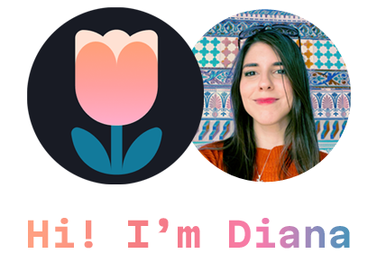

   

 I'm a junior fullstack developer who mixes  art and code in order  to create full,  beautiful and interactive experiences.

   

   
   

    
  

  <a href="https://skillicons.dev">
     
     
      
  </a>

